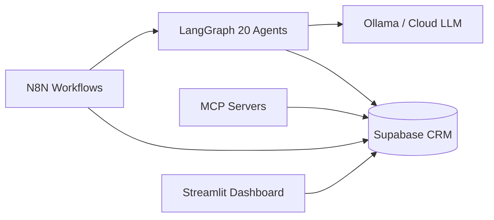

# NIVARA REALTY — AI Digital Marketing System

Phase 1–5 foundation for a **20-agent** digital marketing agency specializing in **Bangalore real estate**. Built on free and open-source tools with optional cloud hosting and LLM fallback.

## Quick Start

```bash
# 1. Configure environment
cp .env.example .env
# Add Supabase keys (free account at supabase.com)

# 2. Start infrastructure
docker compose up -d
docker exec -it nivara-ollama ollama pull llama3.2

# 3. Run Supabase migration (SQL Editor)
# → supabase/migrations/001_initial_schema.sql

# 4. Start agents
cd agents && pip install -e . && nivara-orchestrator

# 5. Import N8N workflows from n8n/workflows/
```

Full setup: **[docs/PHASE1_SETUP.md](docs/PHASE1_SETUP.md)**

## Architecture



Details: **[docs/ARCHITECTURE.md](docs/ARCHITECTURE.md)** · Phase 5: **[docs/PHASE5.md](docs/PHASE5.md)**

## Phase Status

| Phase | Deliverable | Status |
|-------|-------------|--------|
| 1 | Supabase schema, Docker, 12 agents, MCP stubs | ✅ |
| 2 | Gemini Veo video pipeline | ✅ |
| 3 | 4 agents + Render hosting + storage | ✅ |
| 4 | 4 executive agents + Bangalore focus | ✅ |
| 5 | Cloud LLM, API auth, N8N refresh, sim gate | ✅ |

## Project Structure

```
├── docker-compose.yml          # n8n + ollama
├── supabase/migrations/        # PostgreSQL schema
├── n8n/workflows/              # Importable workflow JSON
├── agents/                     # LangGraph + FastAPI orchestrator
├── mcp-servers/                # CRM, Browser, Social, WhatsApp MCP
└── docs/                       # Architecture, setup, agent roster
```

## Agents (20)

MarketAnalyst · RegulatoryWatch · LocationScout · CompetitorSpy · CMO · ContentStrategist · Copywriter · SEOAgent · VisualDesigner · SocialMediaManager · PaidAdsManager · LeadQualification · SalesCoach · WhatsAppAgent · EmailMarketer · AppointmentScheduler · CRM · Analytics · COO · CEO

Full roster: **[docs/AGENT_ROSTER.md](docs/AGENT_ROSTER.md)**

## Gemini Veo Integration (Phase 2)

Upload site photos → AI generates cinematic videos → auto-posts to social media.

Guide: **[docs/PHASE2_VEO.md](docs/PHASE2_VEO.md)**

## Stack

- **Database**: Supabase (PostgreSQL + Storage)
- **Workflows**: N8N (self-hosted Docker)
- **Agents**: LangGraph (Python) — 20 agents
- **LLM**: Ollama locally; Groq/Gemini/OpenRouter in production
- **Video**: Gemini Veo MCP
- **Dashboard**: Streamlit Cloud

Paid upgrade path: **[docs/FREE_TIER_LIMITS.md](docs/FREE_TIER_LIMITS.md)**

## API Endpoints

| Service | URL |
|---------|-----|
| Agent Orchestrator | http://localhost:8000 |
| N8N | http://localhost:5678 |
| Ollama | http://localhost:11434 |
| CRM MCP | http://localhost:8001 |
| Gemini Veo MCP | http://localhost:8006 |
| Dashboard (AREIS) | [Streamlit Cloud](docs/DEPLOYMENT.md) · [GitHub + Supabase setup](docs/GITHUB_AND_SUPABASE_SETUP.md) |
| WhatsApp Mock | http://localhost:8004/webhook/message |

## License

Private — NIVARA REALTY internal use.
