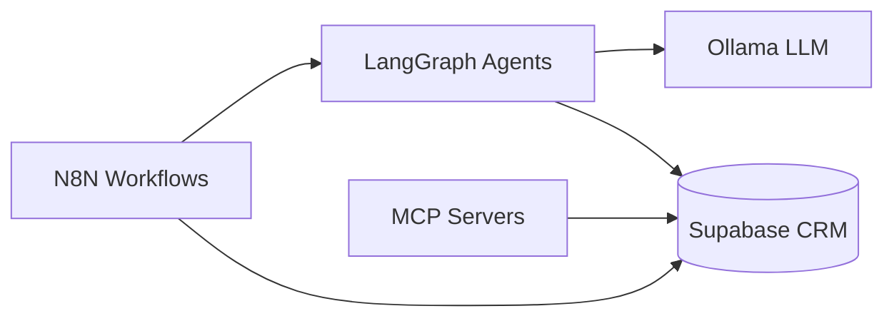

# NIVARA REALTY — AI Digital Marketing System

Phase 1 foundation for a 15–20 agent digital marketing agency specializing in **Chennai and Andhra Pradesh real estate**. Built entirely on free and open-source tools.

## Quick Start

```bash
# 1. Configure environment
cp .env.example .env
# Add Supabase keys (free account at supabase.com)

# 2. Start infrastructure
docker compose up -d
docker exec -it nivara-ollama ollama pull llama3.2

# 3. Run Supabase migration (SQL Editor)
# → supabase/migrations/001_initial_schema.sql

# 4. Start agents
cd agents && pip install -e . && nivara-orchestrator

# 5. Import N8N workflows from n8n/workflows/
```

Full setup: **[docs/PHASE1_SETUP.md](docs/PHASE1_SETUP.md)**

## Architecture



Details: **[docs/ARCHITECTURE.md](docs/ARCHITECTURE.md)**

## Phase 1 Scope

| Deliverable | Status |
|-------------|--------|
| Supabase schema (10 tables + RLS) | ✅ |
| Phase 2 migration (bot_logs, media_assets) | ✅ |
| Docker Compose (n8n + ollama + postgres + dashboard + veo) | ✅ |
| N8N workflows (5) | ✅ |
| LangGraph agents (12 of 20) | ✅ |
| MCP servers (5) | ✅ |
| Gemini Veo photo-to-video → social | ✅ |
| Documentation | ✅ |

## Project Structure

```
├── docker-compose.yml          # n8n + ollama
├── supabase/migrations/        # PostgreSQL schema
├── n8n/workflows/              # Importable workflow JSON
├── agents/                     # LangGraph + FastAPI orchestrator
├── mcp-servers/                # CRM, Browser, Social, WhatsApp MCP
└── docs/                       # Architecture, setup, agent roster
```

## Agents (Phase 1)

CEO · MarketAnalyst · CompetitorSpy · ContentStrategist · SEOAgent · VisualDesigner · SocialMediaManager · LeadQualification · WhatsAppAgent · AppointmentScheduler · CRM · Analytics

Full roster: **[docs/AGENT_ROSTER.md](docs/AGENT_ROSTER.md)**

## Gemini Veo Integration (Phase 2)

Upload site photos → AI generates cinematic videos → auto-posts to social media.

Guide: **[docs/PHASE2_VEO.md](docs/PHASE2_VEO.md)**

## Stack (Free Only)

- **Database**: Supabase (PostgreSQL free tier)
- **Workflows**: N8N (self-hosted Docker)
- **Agents**: LangGraph (Python)
- **LLM**: Ollama (Llama 3.x / Mistral) — no OpenAI/Anthropic
- **MCP**: Local stub servers

Paid upgrade path: **[docs/FREE_TIER_LIMITS.md](docs/FREE_TIER_LIMITS.md)**

## API Endpoints

| Service | URL |
|---------|-----|
| Agent Orchestrator | http://localhost:8000 |
| N8N | http://localhost:5678 |
| Ollama | http://localhost:11434 |
| CRM MCP | http://localhost:8001 |
| Gemini Veo MCP | http://localhost:8006 |
| Dashboard (AREIS) | Deploy permanently — [docs/DEPLOYMENT.md](docs/DEPLOYMENT.md) |
| WhatsApp Mock | http://localhost:8004/webhook/message |

## License

Private — NIVARA REALTY internal use.
