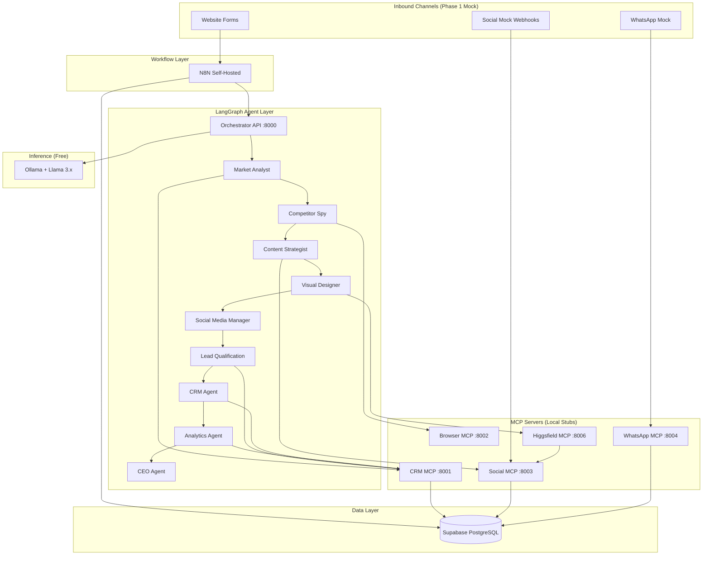
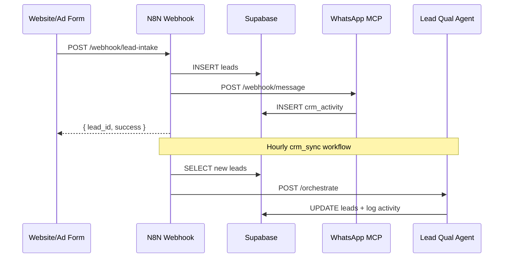

# NIVARA REALTY — System Architecture (Phase 1)

Free-tier, open-source digital marketing agency stack for Chennai and Andhra Pradesh real estate.

## High-Level Architecture



## Component Responsibilities

| Component | Role | Phase 1 Status |
|-----------|------|----------------|
| **Supabase** | CRM database, RLS, REST API | Schema + migrations ready |
| **N8N** | Scheduled workflows, webhooks | 5 importable workflows |
| **LangGraph** | Multi-agent orchestration | 12 agents + CEO synthesis |
| **Ollama** | Local LLM inference | Llama 3.2 default |
| **Higgsfield MCP** | Photo-to-video + social publish | higgsfield-mcp :8006 |
| **MCP Servers** | Tool interfaces for agents/Cursor | 5 servers |
| **Docker Compose** | n8n + ollama + postgres + dashboard | Ready |

## Data Flow: Lead Intake



## Agent Pipeline (Daily 6 AM)

1. **MarketAnalyst** — Pull projects, analyze regional trends
2. **CompetitorSpy** — Review competitor table + browser stub
3. **ContentStrategist** — Generate content plan from market intel
4. **LeadQualification** — Score new leads
5. **CRM** — Follow-up action plan
6. **Analytics** — Review mock ad performance
7. **CEO** — Executive briefing synthesis

## Security Notes

- All secrets via `.env` (never committed)
- Supabase RLS enabled; service role for backend agents
- N8N basic auth enabled by default
- MCP servers bind to localhost in development

## Directory Structure

```
nivara-digital-marketing/
├── docker-compose.yml
├── supabase/migrations/
├── n8n/workflows/
├── agents/src/nivara/
├── mcp-servers/
└── docs/
```
