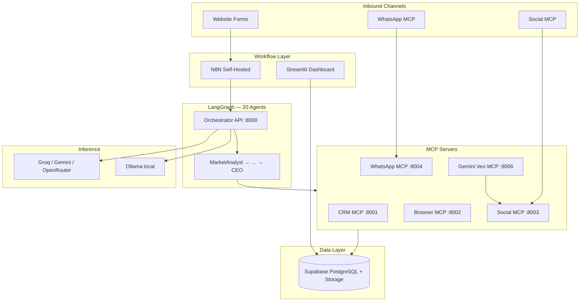

# NIVARA REALTY — System Architecture (Phase 5)

Free-tier digital marketing agency stack for **Bangalore real estate** — 20 LangGraph agents, Supabase CRM, Gemini Veo video, and optional cloud LLM.

## High-Level Architecture



## 20-Agent Pipeline

```
MarketAnalyst → RegulatoryWatch → LocationScout → CompetitorSpy → CMO
  → ContentStrategist → Copywriter → SEOAgent → VisualDesigner
  → SocialMediaManager → PaidAdsManager → LeadQualification → SalesCoach
  → WhatsAppAgent → EmailMarketer → AppointmentScheduler → CRM
  → Analytics → COO → CEO
```

## Component Status (Phase 5)

| Component | Role | Status |
|-----------|------|--------|
| **Supabase** | CRM + media storage | Production-ready |
| **LangGraph** | 20-agent orchestration | Built |
| **Ollama** | Local LLM | Dev only |
| **Cloud LLM** | Groq/Gemini/OpenRouter fallback | Phase 5 |
| **Gemini Veo MCP** | Photo-to-video | Built (quota-dependent) |
| **Social MCP** | FB/IG/LinkedIn posting | Mock |
| **WhatsApp MCP** | Lead scoring webhook | Mock |
| **N8N** | 5 scheduled workflows | Updated Bangalore |
| **Streamlit** | Operations dashboard | Deployed |
| **Render** | Orchestrator + Veo + Social | Blueprint ready |
| **API auth** | Optional X-API-Key | Phase 5 |

## LLM Fallback Chain

When `LLM_PROVIDER=auto` (default):

1. Ollama at `OLLAMA_BASE_URL` (local dev)
2. Groq if `GROQ_API_KEY` set
3. Gemini if `GEMINI_API_KEY` set
4. OpenRouter if `OPENROUTER_API_KEY` set
5. Stub message (only if nothing configured)

## Environment Variables

| Variable | Purpose |
|----------|---------|
| `LLM_PROVIDER` | `auto`, `ollama`, `groq`, `gemini`, `openrouter` |
| `GROQ_API_KEY` | Groq cloud inference |
| `GEMINI_API_KEY` | Veo + Gemini LLM |
| `ORCHESTRATOR_API_KEY` | Protect `/orchestrate` |
| `WHATSAPP_MCP_URL` | WhatsApp agent MCP endpoint |
| `ENABLE_DASHBOARD_SIMULATION` | Demo data in Streamlit (`false` default) |

## Deployment Topology

| Service | Local | Production |
|---------|-------|------------|
| Orchestrator | :8000 | Render `nivara-orchestrator` |
| Veo MCP | :8006 | Render `nivara-veo-mcp` |
| Social MCP | :8003 | Render `nivara-social-mcp` |
| Dashboard | Streamlit Cloud | Streamlit Cloud |
| Database | Supabase pooler | Supabase pooler |

## Docs Index

- [PHASE5.md](PHASE5.md) — This phase
- [PRODUCTION.md](PRODUCTION.md) — Deploy checklist
- [AGENT_ROSTER.md](AGENT_ROSTER.md) — All 20 agents
- [PHASE4.md](PHASE4.md) — Executive agents
