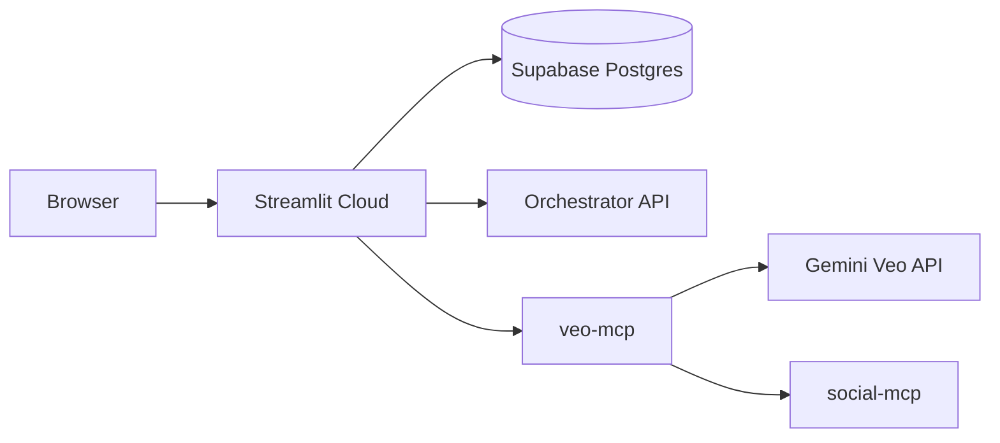

# Permanent Dashboard — Streamlit Community Cloud

The NIVARA dashboard is hosted permanently on **[Streamlit Community Cloud](https://share.streamlit.io)**.

## Why Streamlit Cloud?

- Built for Streamlit apps (WebSockets, persistent sessions)
- Free tier with a **permanent URL** (`https://your-app.streamlit.app`)
- Auto-redeploys on every `git push`
- No tunnels, no port forwarding, no expiring links

---

## Deploy in 5 steps

### 1. Push this repo to GitHub

Already on: `narendhrareddi-ship-it/Nivara-AREIS`

### 2. Open Streamlit Community Cloud

Go to [share.streamlit.io](https://share.streamlit.io) → sign in with GitHub.

### 3. Create a new app

| Setting | Value |
|---------|-------|
| Repository | `narendhrareddi-ship-it/Nivara-AREIS` |
| Branch | `main` (or your feature branch) |
| Main file path | `dashboard/app.py` |

### 4. Add secrets

In the app → **Settings → Secrets**, paste (edit values):

```toml
SUPABASE_URL = "https://mxjhwjxxqtkwsrwtqwuc.supabase.co"
DB_HOST = "aws-1-ap-south-1.pooler.supabase.com"
DB_PORT = "5432"
DB_NAME = "postgres"
DB_USER = "postgres.mxjhwjxxqtkwsrwtqwuc"
DB_PASSWORD = "your-supabase-password"

ORCHESTRATOR_URL = "http://localhost:8000"
VEO_MCP_URL = "http://localhost:8006"
```

Template: [`dashboard/.streamlit/secrets.toml.example`](../dashboard/.streamlit/secrets.toml.example)

### 5. Deploy

Click **Deploy**. Your permanent URL will be:

```
https://nivara-areis.streamlit.app
```

(URL depends on the app name you choose.)

---

## Local development

```bash
cp dashboard/.streamlit/secrets.toml.example dashboard/.streamlit/secrets.toml
# Edit secrets.toml with your local values
pip install -r dashboard/requirements.txt
./scripts/start-dashboard.sh
```

Open http://localhost:8501

---

## Backend requirements

Streamlit Cloud runs the **dashboard only**. These services must be reachable over HTTPS:

| Service | Used for | Deploy separately on |
|---------|----------|----------------------|
| PostgreSQL | Leads, posts, media | Supabase (recommended) or Render Postgres |
| `veo-mcp` | Media tab (photo → video) | Render / Railway / Fly.io |
| `social-mcp` | Social publishing | Render / Railway |
| Orchestrator | Pipeline controls | Render / Railway |

Use **Supabase** for the database — the project already has migrations in `supabase/migrations/`.

---

## Environment variables reference

| Secret key | Required | Description |
|------------|----------|-------------|
| `DB_HOST` | Yes | Postgres hostname |
| `DB_PORT` | Yes | Usually `5432` |
| `DB_NAME` | Yes | `nivara` |
| `DB_USER` | Yes | Database user |
| `DB_PASSWORD` | Yes | Database password |
| `ORCHESTRATOR_URL` | For Settings tab | Agent orchestrator API |
| `VEO_MCP_URL` | For Media tab | Gemini Veo MCP server |
| `OLLAMA_BASE_URL` | Optional | Local/cloud Ollama |

---

## Architecture



---

## Troubleshooting

| Issue | Fix |
|-------|-----|
| App won't start | Check **Manage app → Logs** for missing dependencies |
| No data shown | Verify `DB_*` secrets and run Supabase migrations |
| Media upload fails | Set `VEO_MCP_URL` to a public HTTPS endpoint |
| Secrets not loading | Keys must match `dashboard/config.py` exactly |

---

## Updates

Every push to the connected branch triggers an automatic redeploy. No manual steps needed.
