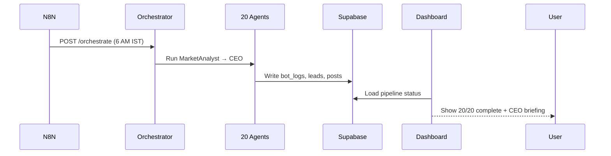

# NIVARA AREIS — Product Requirements Document

| Field | Value |
|-------|-------|
| **Product** | NIVARA AREIS (Autonomous Real Estate Intelligence System) |
| **Version** | 1.0 |
| **Date** | June 2026 |
| **Owner** | NIVARA REALTY |
| **Status** | Phase 5 — Production (cloud-hosted) |
| **Repository** | [narendhrareddi-ship-it/Nivara-AREIS](https://github.com/narendhrareddi-ship-it/Nivara-AREIS) |

---

## 1. Executive Summary

NIVARA AREIS is an autonomous AI digital marketing platform built exclusively for **NIVARA REALTY** to operate a full-service marketing agency for **Bangalore residential real estate**. The product combines a **20-agent LangGraph pipeline**, a **Streamlit operations dashboard**, **Gemini Veo video generation**, and **Supabase CRM** into a single system that can research markets, create content, qualify leads, nurture prospects, and produce executive briefings — with minimal human intervention.

The system is deployed on a **free-to-low-cost cloud stack** (Render + Supabase + Gemini + Groq) and is designed for internal operations use, not public SaaS distribution.

---

## 2. Product Vision & Mission

### Vision
Become the always-on AI marketing department for NIVARA REALTY — analyzing Bangalore micro-markets daily, publishing property content, and moving leads through the funnel while leadership receives a synthesized CEO briefing every cycle.

### Mission
Automate repetitive marketing, research, and lead-management work so the human team focuses on site visits, negotiations, and high-value client relationships.

### Strategic Principles
1. **Bangalore-first** — all agents, data, and workflows default to Karnataka real estate context.
2. **Cloud-native production** — no dependency on local developer machines for daily operations.
3. **Graceful degradation** — LLM and social integrations fall back or stub rather than crash the platform.
4. **Observable automation** — every agent action is logged and visible in the dashboard.

---

## 3. Problem Statement

NIVARA REALTY faces operational bottlenecks typical of mid-size developers:

| Pain Point | Impact |
|------------|--------|
| Manual market research across 8+ Bangalore corridors | Delayed campaign decisions |
| Disconnected lead sources (website, WhatsApp, social) | Leads fall through cracks |
| Slow content production (copy, video, SEO) | Missed demand windows |
| No unified view of pipeline health | Leadership lacks daily situational awareness |
| Expensive agency retainers | High fixed cost for inconsistent output |

**NIVARA AREIS** addresses these by running a coordinated 20-agent pipeline on schedule, centralizing CRM data in Supabase, and giving operators a single dashboard to monitor, trigger, and override AI actions.

---

## 4. Target Users & Personas

### Primary Persona — Marketing Operations Manager
- **Goals:** Monitor daily agent runs, publish social content, review lead quality, trigger full pipeline.
- **Technical level:** Low — uses web dashboard only.
- **Key screens:** Pipeline, Leads, Social, Media, Settings.

### Secondary Persona — CMO / Leadership
- **Goals:** Read CEO daily briefing, review market trends, approve campaign direction.
- **Technical level:** Low.
- **Key screens:** Activity, Pipeline (completion status), Leads funnel.

### Tertiary Persona — System Administrator
- **Goals:** Manage Render/Supabase secrets, redeploy services, configure API keys.
- **Technical level:** High.
- **Key surfaces:** Render dashboard, Supabase console, GitHub Actions, `.env` / secrets.

### Out of Scope Users
- External homebuyers (no consumer-facing product)
- Multi-tenant agency clients (single-developer internal tool)

---

## 5. Goals & Success Metrics

### Business Goals
| Goal | Target |
|------|--------|
| Daily autonomous market analysis | 1 full 20-agent cycle per day (6 AM IST via N8N) |
| Lead response time | AI qualification within 1 hour of intake |
| Content velocity | ≥1 property video + social post per week |
| Executive visibility | CEO briefing after every full pipeline run |

### Product KPIs (Dashboard-Measurable)
| Metric | Source |
|--------|--------|
| Total leads | `leads` table |
| Hot leads (score ≥ 70) | `leads.score` |
| Conversion rate | `leads.status = converted` |
| Social reach | `social_posts.reach` |
| Agent run count | `bot_logs` |
| Pipeline completion | 20/20 agents in latest cycle |

### Technical KPIs
| Metric | Target |
|--------|--------|
| Orchestrator uptime | `/health` returns `db_connected: true` |
| Dashboard load time | < 5s on warm Render instance |
| LLM availability | `llm_available: true` (Gemini or Groq fallback) |
| Cold start tolerance | Accept ~50s first request after Render sleep |

---

## 6. Product Scope

### In Scope (Phase 5 — Current)
- 20-agent sequential LangGraph pipeline
- Streamlit operations dashboard (7 tabs)
- Supabase PostgreSQL CRM (12 tables)
- Supabase Storage for photos/videos
- Gemini Veo image-to-video pipeline
- Cloud LLM: Gemini primary, Groq backup, OpenRouter optional
- Render-hosted orchestrator, Veo MCP, Social MCP, dashboard
- N8N workflow triggers (5 JSON workflows)
- Mock WhatsApp and social publishing (DB-backed)
- Manual agent dispatch and full pipeline trigger from dashboard
- Lead scoring, funnel charts, activity logs
- Desktop launcher for Windows dashboard access

### Out of Scope (Current Release)
- Multi-city / multi-developer support
- Role-based dashboard authentication
- Live Meta WhatsApp Business API
- Live Facebook/Instagram/LinkedIn/X API publishing
- Live Google Ads / Meta Ads API integration
- Mobile native app
- Payment / billing module

### Future Scope (Phase 6+)
- Real WhatsApp Business API
- Real social platform publishing
- Live competitor web scraping (Playwright)
- Google/Meta Ads live analytics
- Dashboard authentication & audit roles
- Automated test suite and Sentry monitoring

---

## 7. Functional Requirements

### FR-1: Operations Dashboard

| ID | Requirement | Priority |
|----|-------------|----------|
| FR-1.1 | Display live IST clock and system build version | P1 |
| FR-1.2 | Show Bangalore market overview chips (price, listings, demand, hot corridor) | P1 |
| FR-1.3 | Display 8 KPI stat cards (leads, posts, reach, agent runs, etc.) | P1 |
| FR-1.4 | **Activity tab** — filterable agent log stream from `bot_logs` | P1 |
| FR-1.5 | **Pipeline tab** — visual 20-node graph with done/running/wait states | P1 |
| FR-1.6 | **Social tab** — post feed, new post form, featured video panel | P1 |
| FR-1.7 | **Media tab** — photo upload, Veo video generation, media library | P1 |
| FR-1.8 | **Chat tab** — WhatsApp conversation view and manual message send | P2 |
| FR-1.9 | **Leads tab** — filterable table, score pie, status bar, conversion funnel | P1 |
| FR-1.10 | **Settings tab** — pipeline controls, per-agent RUN buttons, system status | P1 |
| FR-1.11 | System status cards: PostgreSQL, Orchestrator, LLM provider, Dashboard | P1 |
| FR-1.12 | Detect and warn if orchestrator runs legacy 12-agent build | P1 |

### FR-2: Agent Orchestration

| ID | Requirement | Priority |
|----|-------------|----------|
| FR-2.1 | Expose `GET /health` with DB, LLM, and agent count status | P0 |
| FR-2.2 | Expose `POST /orchestrate` for full or partial agent runs | P0 |
| FR-2.3 | Run 20 agents in fixed sequential order via LangGraph | P0 |
| FR-2.4 | Log every agent start/complete to `bot_logs` | P0 |
| FR-2.5 | Support `region`, `task`, `agents[]`, `media_assets`, `leads` parameters | P1 |
| FR-2.6 | Optional `X-API-Key` authentication on `/orchestrate` | P2 |
| FR-2.7 | CEO agent produces executive synthesis as final output | P1 |

### FR-3: LLM Inference

| ID | Requirement | Priority |
|----|-------------|----------|
| FR-3.1 | Primary LLM: Google Gemini (`gemini-2.0-flash`) | P0 |
| FR-3.2 | Automatic fallback to Groq on Gemini quota/error | P0 |
| FR-3.3 | Optional fallback to OpenRouter | P2 |
| FR-3.4 | Stub response if all providers fail (no crash) | P0 |
| FR-3.5 | Report active provider in `/health` | P1 |

### FR-4: Media & Video (Gemini Veo)

| ID | Requirement | Priority |
|----|-------------|----------|
| FR-4.1 | Upload property photos (JPEG/PNG/WebP) via Veo MCP | P1 |
| FR-4.2 | Generate cinematic MP4 from photo + motion prompt | P1 |
| FR-4.3 | Store assets in Supabase Storage (`media` bucket) | P0 |
| FR-4.4 | Auto-publish completed video to social MCP (mock) | P1 |
| FR-4.5 | Support `VEO_MOCK=true` for quota-limited environments | P2 |
| FR-4.6 | Display media library with photo/video previews in dashboard | P1 |

### FR-5: CRM & Leads

| ID | Requirement | Priority |
|----|-------------|----------|
| FR-5.1 | Store leads with score (0–100), status, AI qualification notes | P0 |
| FR-5.2 | Lead statuses: new, contacted, qualified, nurturing, negotiating, converted, lost | P0 |
| FR-5.3 | Log CRM activity (WhatsApp, email, site visit, AI actions) | P1 |
| FR-5.4 | Seed demo leads on first dashboard load if table empty | P2 |
| FR-5.5 | LeadQualification agent scores and recommends next action | P1 |

### FR-6: Social & Channels

| ID | Requirement | Priority |
|----|-------------|----------|
| FR-6.1 | Social MCP stores posts for Facebook, Instagram, LinkedIn, Twitter | P1 |
| FR-6.2 | SocialMediaManager agent schedules/publishes via social MCP | P1 |
| FR-6.3 | Dashboard manual post creation with platform and reach | P2 |
| FR-6.4 | WhatsApp MCP mock webhook for inbound lead messages | P2 |

### FR-7: Automation (N8N)

| ID | Requirement | Priority |
|----|-------------|----------|
| FR-7.1 | Daily 6 AM IST — full 20-agent pipeline | P1 |
| FR-7.2 | Lead intake webhook — create lead + trigger qualification | P1 |
| FR-7.3 | Hourly CRM sync | P2 |
| FR-7.4 | Daily 11 PM IST — analytics collection | P2 |
| FR-7.5 | Daily 10 AM IST — social video publish | P2 |

### FR-8: Pipeline Auto-Sync

| ID | Requirement | Priority |
|----|-------------|----------|
| FR-8.1 | On dashboard load, detect incomplete pipeline (< 20 agents) | P1 |
| FR-8.2 | Auto-run pipeline in-process or via orchestrator HTTP | P1 |
| FR-8.3 | Configurable `AUTO_SYNC_ON_LOAD`, `AUTO_SYNC_PIPELINE`, interval | P2 |
| FR-8.4 | Session cooldown to prevent duplicate runs within 300s | P2 |

---

## 8. Non-Functional Requirements

### Performance
| ID | Requirement |
|----|-------------|
| NFR-1 | Dashboard uses cached DB layer (`fast_db.py`) — no full-page auto-refresh |
| NFR-2 | HTTP health checks cached 45s TTL |
| NFR-3 | Individual agent LLM timeout: 120s; full pipeline: 900s |
| NFR-4 | Veo generation may take 2–10 minutes — async wait with user feedback |

### Availability & Reliability
| ID | Requirement |
|----|-------------|
| NFR-5 | Render free tier cold starts (~50s) are acceptable |
| NFR-6 | System remains operational if LLM fails — stub text, DB intact |
| NFR-7 | GitHub Actions health check every 12 hours on all 4 Render endpoints |

### Security
| ID | Requirement |
|----|-------------|
| NFR-8 | Secrets never committed to git (`.env`, `secrets.toml` gitignored) |
| NFR-9 | Supabase RLS enabled; service role key backend-only |
| NFR-10 | Optional API key on `/orchestrate` endpoint |
| NFR-11 | Dashboard has no built-in auth (known limitation — internal URL only) |

### Scalability
| ID | Requirement |
|----|-------------|
| NFR-12 | Designed for single-developer scale (< 10K leads) on Supabase free tier |
| NFR-13 | Media stored in Supabase Storage, not Render disks |

### Maintainability
| ID | Requirement |
|----|-------------|
| NFR-14 | Infrastructure as code via `render.yaml` Blueprint |
| NFR-15 | One-click Render setup via `scripts/render-setup.py` |
| NFR-16 | Agent roster documented in `docs/AGENT_ROSTER.md` |

---

## 9. User Journeys

### Journey A — Daily Autonomous Marketing Cycle


### Journey B — Property Photo to Social Video
1. Operator opens **Media** tab.
2. Uploads site photo → Veo MCP stores in Supabase Storage.
3. Enters motion prompt and caption.
4. Clicks **GENERATE VIDEO & POST**.
5. Veo MCP calls Gemini Veo API → MP4 generated (2–10 min).
6. Social MCP creates posts for selected platforms.
7. Video appears in Media Library and Social tab.

### Journey C — Lead Intake to Nurture
1. Website form hits N8N webhook → lead created in Supabase.
2. LeadQualification agent scores lead 0–100.
3. WhatsAppAgent sends nurturing message (mock).
4. EmailMarketer queues drip sequence.
5. AppointmentScheduler proposes site visit.
6. Operator reviews lead in **Leads** tab and chats in **Chat** tab.

### Journey D — Manual Override
1. Operator opens **Settings** → Manual Agent Dispatch.
2. Clicks **RUN** on specific agent (e.g., CompetitorSpy).
3. Orchestrator runs single agent → logs to Activity tab.

---

## 10. System Architecture

### Production Topology

| Service | URL | Runtime |
|---------|-----|---------|
| Dashboard | https://nivara-dashboard.onrender.com | Python / Streamlit |
| Orchestrator | https://nivara-orchestrator.onrender.com | Docker / FastAPI |
| Veo MCP | https://nivara-veo-mcp.onrender.com | Docker / FastAPI |
| Social MCP | https://nivara-social-mcp.onrender.com | Docker / FastAPI |
| Database | `aws-1-ap-south-1.pooler.supabase.com` | Supabase PostgreSQL |
| Storage | `mxjhwjxxqtkwsrwtqwuc.supabase.co` | Supabase Storage (`media`) |

### Technology Stack

| Layer | Technology |
|-------|------------|
| Agents | Python, LangGraph, FastAPI, uvicorn |
| Dashboard | Streamlit, Plotly, pandas |
| Database | PostgreSQL 16 (Supabase) |
| LLM | Gemini 2.0 Flash → Groq Llama 3.3 70B → OpenRouter |
| Video AI | Google Gemini Veo 3.1 |
| Workflows | N8N (self-hosted Docker) |
| Hosting | Render (free tier, Singapore) |
| CI/CD | GitHub Actions |

### MCP Server Map

| Server | Port | Production | Purpose |
|--------|------|------------|---------|
| CRM MCP | 8001 | Local | Lead CRUD, activity logging |
| Browser MCP | 8002 | Local | Competitor scraping (stub) |
| Social MCP | 8003 | Render | Social post storage (mock publish) |
| WhatsApp MCP | 8004 | Local | Lead message webhook (mock) |
| Veo MCP | 8006 | Render | Photo upload, video generation |

---

## 11. Agent Specifications (20 Agents)

### Pipeline Order
```
MarketAnalyst → RegulatoryWatch → LocationScout → CompetitorSpy → CMO
  → ContentStrategist → Copywriter → SEOAgent → VisualDesigner
  → SocialMediaManager → PaidAdsManager → LeadQualification → SalesCoach
  → WhatsAppAgent → EmailMarketer → AppointmentScheduler → CRM
  → Analytics → COO → CEO
```

### Agent Catalog

| Agent | Layer | Primary Output |
|-------|-------|----------------|
| **MarketAnalyst** | Intelligence | Bangalore price trends, demand signals, campaign focus |
| **RegulatoryWatch** | Intelligence | RERA/BBMP compliance, mandatory disclosures |
| **LocationScout** | Intelligence | 8-corridor micro-market analysis |
| **CompetitorSpy** | Intelligence | Competitor launches, pricing, ad monitoring |
| **CMO** | Executive | Brand positioning, campaign themes |
| **ContentStrategist** | Content | Content calendar, Kannada/English mix |
| **Copywriter** | Content | Ad copy, landing pages, email sequences |
| **SEOAgent** | Content | Local SEO, schema, keyword strategy |
| **VisualDesigner** | Content | Veo motion prompts, photo-to-video |
| **SocialMediaManager** | Channels | FB/IG/LinkedIn/X scheduling and publishing |
| **PaidAdsManager** | Channels | Google/Meta budget, CPL optimization |
| **LeadQualification** | Sales | Lead scoring 0–100, project matching |
| **SalesCoach** | Sales | Objection handling, negotiation scripts |
| **WhatsAppAgent** | Sales | Conversational lead nurturing |
| **EmailMarketer** | Sales | Drip campaigns, newsletters |
| **AppointmentScheduler** | Sales | Site visit and call scheduling |
| **CRM** | Sales | Lifecycle management, follow-ups |
| **Analytics** | Analytics | Campaign ROI, CPL, channel performance |
| **COO** | Executive | SLA monitoring, operational review |
| **CEO** | Executive | Daily executive briefing, top 3 priorities |

### Bangalore Market Configuration
- **Region:** Bangalore, Karnataka
- **Priority corridors:** Whitefield, Sarjapur Road, Electronic City, HSR Layout, Koramangala, Hebbal, Yelahanka, Devanahalli

---

## 12. Data Model

### Core Tables (12)

| Table | Purpose |
|-------|---------|
| `projects` | Property inventory, RERA, amenities, pricing |
| `leads` | Prospects with score, status, AI notes |
| `customers` | Converted buyers |
| `campaigns` | Marketing campaigns by channel |
| `competitors` | Competitor intelligence (JSONB) |
| `social_posts` | Published/planned social content |
| `media_assets` | Photos and Veo-generated videos |
| `ad_performance` | Ad metrics (mock in current phase) |
| `crm_activity` | All touchpoints (WhatsApp, email, visits) |
| `bot_logs` | Agent audit trail |
| `appointments` | Scheduled site visits and calls |
| `site_visits` | Visit outcomes and interest level |

---

## 13. Integrations & Dependencies

### Production Integrations (Live)

| Integration | Purpose | Fallback |
|-------------|---------|----------|
| Google Gemini API | LLM + Veo video | Groq LLM; `VEO_MOCK` for video |
| Groq API | LLM backup | OpenRouter; stub text |
| Supabase | DB + file storage | None — required |
| Render | Service hosting | Manual redeploy |

### Mock / Phase 6 Integrations

| Integration | Current State |
|-------------|---------------|
| Meta WhatsApp Business API | Mock via whatsapp-mcp |
| Facebook/Instagram Graph API | Mock via social-mcp |
| LinkedIn API | Mock |
| Twitter/X API | Mock |
| Google Ads API | Mock `ad_performance` data |
| Playwright scraping | browser-mcp stub |

### Required Environment Variables (Production)

| Variable | Service | Required |
|----------|---------|----------|
| `DB_PASSWORD` | All | Yes |
| `GEMINI_API_KEY` | Orchestrator, Veo MCP | Yes |
| `GROQ_API_KEY` | Orchestrator, Dashboard | Recommended |
| `SUPABASE_URL` | Orchestrator, Veo MCP | Yes |
| `SUPABASE_SERVICE_ROLE_KEY` | Orchestrator, Veo MCP | Yes |
| `ORCHESTRATOR_URL` | Dashboard | Yes |
| `VEO_MCP_URL` | Dashboard, Orchestrator | Yes |

---

## 14. Release History & Roadmap

### Completed Phases

| Phase | Deliverable | Status |
|-------|-------------|--------|
| 1 | Supabase schema, Docker, 12 agents, MCP stubs | ✅ Done |
| 2 | Gemini Veo video pipeline | ✅ Done |
| 3 | +4 agents, Render hosting, Supabase Storage | ✅ Done |
| 4 | +4 executive agents, Bangalore focus | ✅ Done |
| 5 | Cloud LLM, API auth, N8N refresh, performance | ✅ Done |
| 5.1 | Ollama removed; Gemini + Groq cloud-only | ✅ Done |

### Phase 6 Roadmap (Planned)

| Item | Priority |
|------|----------|
| Real WhatsApp Business API | P0 |
| Live social platform publishing | P0 |
| Playwright competitor scraping | P1 |
| Google/Meta Ads live analytics | P1 |
| Dashboard authentication | P1 |
| Deploy whatsapp-mcp to Render | P2 |
| Automated tests + Sentry | P2 |

### Upgrade Cost Path

| Tier | Monthly Est. | Adds |
|------|--------------|------|
| Current (free) | $0 | Render free, Supabase free, Gemini/Groq free tiers |
| Phase 2+ | $0–50 | Domain, Veo billing, email API |
| Phase 3+ | $100–300 | Ad spend, Supabase Pro |
| Phase 4+ | $300+ | Premium LLMs, monitoring, paid hosting |

---

## 15. Risks & Mitigations

| Risk | Impact | Mitigation |
|------|--------|------------|
| Gemini API quota exhausted | Agent text degrades to stub | Groq backup configured; add OpenRouter |
| Gemini Veo 429 errors | No new videos | `VEO_MOCK=true`; enable billing |
| Render cold start | 50s delay on first visit | Health-check pings; user education |
| No dashboard auth | Unauthorized access if URL leaked | Internal use only; add auth in Phase 6 |
| Mock social/WhatsApp | Posts not visible on real platforms | Phase 6 real API integration |
| Single-region focus | Cannot expand without refactor | Acceptable for v1; region config exists |

---

## 16. Acceptance Criteria (Production Ready)

- [x] All 20 agents execute in sequence via `/orchestrate`
- [x] Dashboard loads from Render with Supabase connection
- [x] `/health` returns `db_connected: true`, `llm_available: true`, `agent_count: 20`
- [x] Gemini Veo generates video from uploaded photo
- [x] Groq API configured as LLM fallback on Render
- [x] Pipeline progress visible in dashboard Pipeline tab
- [x] Leads table populated with scoring and funnel charts
- [x] No Ollama dependency in production path
- [ ] Real WhatsApp and social publishing (Phase 6)
- [ ] Dashboard user authentication (Phase 6)

---

## 17. Appendix

### A. Dashboard Tab Map

| Tab | Primary Actions |
|-----|-----------------|
| Activity | View/filter agent logs |
| Pipeline | Monitor 20-agent graph progress |
| Social | View/create posts, featured video |
| Media | Upload photo, generate Veo video |
| Chat | WhatsApp conversations |
| Leads | Manage and analyze lead funnel |
| Settings | Run pipeline, dispatch agents, system status |

### B. API Endpoints

| Method | Path | Auth | Description |
|--------|------|------|-------------|
| GET | `/health` | None | Service health |
| POST | `/orchestrate` | Optional API key | Run agent pipeline |
| POST | `/upload` | None | Veo MCP photo upload |
| POST | `/call` | None | Veo MCP tool invocation |

### C. N8N Workflows

| File | Schedule | Action |
|------|----------|--------|
| `daily_market_pipeline.json` | 6 AM IST daily | Full 20-agent run |
| `lead_intake_webhook.json` | Webhook | Create lead |
| `crm_sync.json` | Hourly | CRM sync |
| `analytics_collector.json` | 11 PM IST daily | Analytics agents |
| `social_video_publish.json` | 10 AM IST daily | Publish videos |

### D. Related Documentation

- [ARCHITECTURE.md](ARCHITECTURE.md) — technical architecture
- [AGENT_ROSTER.md](AGENT_ROSTER.md) — agent details
- [PRODUCTION.md](PRODUCTION.md) — deployment guide
- [FREE_TIER_LIMITS.md](FREE_TIER_LIMITS.md) — cost constraints
- [PHASE2_VEO.md](PHASE2_VEO.md) — video pipeline guide

---

*Document maintained by NIVARA REALTY. Update when phases ship or scope changes.*
