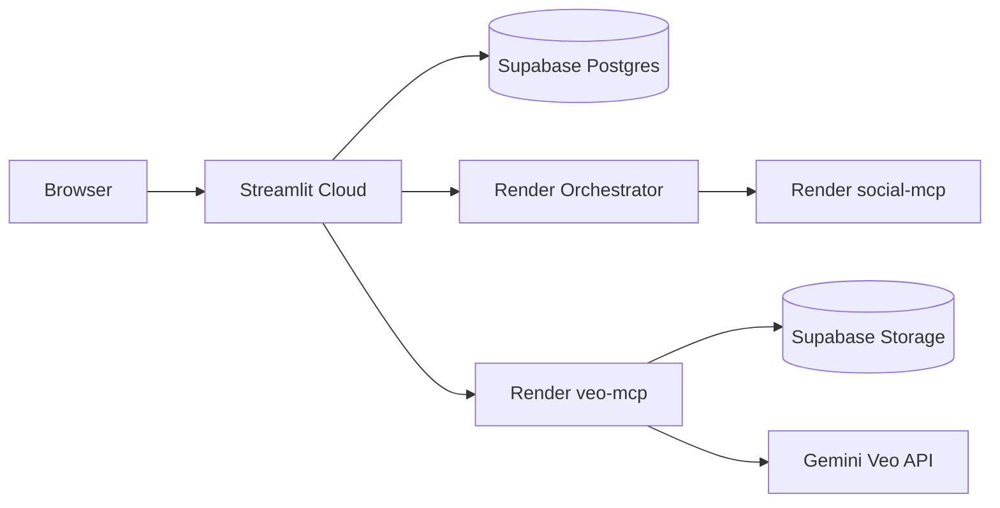

# Production Deployment — NIVARA AREIS

Bangalore-focused 20-agent system. Dashboard on Streamlit Cloud; backend on Render or local production script.

## Quick start (local production backend)

```bash
cp .env.production.example .env   # fill in Supabase + Gemini keys
chmod +x scripts/start-production.sh
./scripts/start-production.sh
```

Verify:

```bash
curl http://localhost:8003/health
curl http://localhost:8006/health
curl http://localhost:8000/health
```

## 1. Merge to main (done via CI/agent)

PRs #2 (Phase 3 hosting) and #3 (Bangalore + Phase 4) merge into `main`. Streamlit auto-redeploys on push.

## 2. Supabase (database + storage)

| Step | Action |
|------|--------|
| DB | Migrations in `supabase/migrations/` already applied |
| Pooler | Use `aws-1-ap-south-1.pooler.supabase.com` from cloud VMs |
| Storage | Run `python3 scripts/setup-supabase-storage.py` to create `media` bucket |

## 3. Render backend (recommended for Streamlit Cloud)

1. Go to [Render Blueprints](https://dashboard.render.com/blueprints) → **New Blueprint Instance**
2. Connect repo `narendhrareddi-ship-it/Nivara-AREIS`, branch `main`
3. Set secret env vars when prompted:

| Variable | Value |
|----------|-------|
| `DB_HOST` | `aws-1-ap-south-1.pooler.supabase.com` |
| `DB_USER` | `postgres.mxjhwjxxqtkwsrwtqwuc` |
| `DB_PASSWORD` | your Supabase DB password |
| `GEMINI_API_KEY` | your Gemini API key |
| `SUPABASE_URL` | `https://mxjhwjxxqtkwsrwtqwuc.supabase.co` |
| `SUPABASE_SERVICE_ROLE_KEY` | service role key |
| `OLLAMA_BASE_URL` | cloud Ollama URL or leave empty (stub mode) |
| `MEDIA_PUBLIC_BASE_URL` | `https://nivara-veo-mcp.onrender.com/media` |

4. After deploy, note service URLs:
   - `https://nivara-orchestrator.onrender.com`
   - `https://nivara-veo-mcp.onrender.com`
   - `https://nivara-social-mcp.onrender.com`

> Free Render services spin down after inactivity (~50s cold start).

## 4. Streamlit Cloud secrets

In [share.streamlit.io](https://share.streamlit.io) → your app → **Settings → Secrets**:

```toml
SUPABASE_URL = "https://mxjhwjxxqtkwsrwtqwuc.supabase.co"
DB_HOST = "aws-1-ap-south-1.pooler.supabase.com"
DB_PORT = "5432"
DB_NAME = "postgres"
DB_USER = "postgres.mxjhwjxxqtkwsrwtqwuc"
DB_PASSWORD = "your-password"

ORCHESTRATOR_URL = "https://nivara-orchestrator.onrender.com"
VEO_MCP_URL = "https://nivara-veo-mcp.onrender.com"
OLLAMA_BASE_URL = "http://localhost:11434"
```

Reboot the app after saving secrets.

## 5. Production checklist

- [ ] `main` branch merged with Phase 3 + 4
- [ ] Supabase `media` storage bucket created
- [ ] Render Blueprint deployed (3 services healthy)
- [ ] Streamlit secrets updated with Render HTTPS URLs
- [ ] Dashboard shows Bangalore market data
- [ ] Media tab upload → veo-mcp → Supabase Storage
- [ ] Settings → Full Pipeline runs 20 agents

## Architecture



## Troubleshooting

| Issue | Fix |
|-------|-----|
| Render build fails | Check Docker build logs; ensure `agents/README.md` exists |
| DB connection timeout | Use pooler host, not `db.xxx.supabase.co` |
| Veo 429 quota | Enable billing on Google AI or set `VEO_MOCK=true` temporarily |
| Pipeline offline | Render free tier asleep — hit `/health` first to wake |
| Wrong region | All defaults are `Bangalore`; check `regions.py` |
